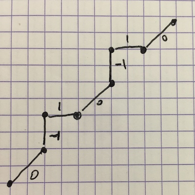

# Capes 2019

Le sujet est ici : [EP1_Info_2019.pdf][1]

## Problème 1 : base 3 équilibrée

### PARTIE I --- Généralités

#### Question 1

##### 1a

- $\overline{1(-1)0(-1)}^e = 1 \times 3^3 + -1 \times 3^2 + 0 \times 3 - 1 = 17$
- $\overline{1111}^e = 3^3 + 3^2 + 3 + 1 = 40$
- $\overline{1(-1)(-1)(-1)(-1)}^e = 3^4 - 3^3 - 3^2 - 3 - 1 = 41$

##### 1b

| base 10 | base e     | Explication |
| ------- | ------     | ----------- |
| 1       | 1          | = 1         |
| 2       | 1(-1)      | = 3 - 1     |
| 3       | 10         | = 3         |
| 4       | 11         | = 3 + 1     |
| 5       | 1(-1)(-1)  | = 9 - 3 - 1 |
| 6       | 1(-1)0     | = 9 - 3     |
| 7       | 1(-1)1     | = 9 - 3 + 1 |
| 8       | 10(-1)     | = 9 - 1     |
| 9       | 100        | = 9         |


#### Question 2

- $A_k = \overline{11...1}^e = 3^k + 3^{k-1} + ... + 3 + 1$
- $B_k = \overline{1(-1)...(-1)}^e = 3^k - 3^{k-1} - ... - 3 - 1$


#### Question 3

On modélise par la liste $[a_{p-1},\ldots a_1, a_0]$ le nombre $\overline{a_0a_1\ldots a_{p-1}}^e$. Définir `valeur(L)`


[1]:http://www4.ac-nancy-metz.fr/capesmath/data/uploads/EP1_info_2019.pdf


```python
def valeur(L):
    return sum(a * 3 ** index for index, a in enumerate(L))
```


```python
valeur([1, 0, -1, -1, 1])
```


    46


### PARTIE II --- Existence et unicité

#### Question 4

##### 4a

On suppose qu'un entier n est tel que : n = 3q + r et q s'écrit $\overline{a_0\ldots a_{p-1}}^e$. Dès lors n s'écrit : 

- si r = 0 : $\overline{a_0\ldots a_{p-1}0}^e$
- si r = 1 : $\overline{a_0\ldots a_{p-1}1}^e$

##### 4b

On suppose que q > 0 et q + 1 s'écrit $\overline{b_0\ldots b_{p-1}}^e$. Dès lors si r = 2, n = 3(q + 1) - 1 et donc s'écrit $\overline{b_0\ldots b_{p-1}(-1)}^e$

##### 4c

Montrons que : pour tout n ≥ 0, n admet une écriture en base 3 équilibrée.

- D'après 1b il existe n0 ≥ 0 tel que pour tout n < n0, n s'écrit en base 3 équilibrée (HR)
- Voyons pour n + 1 :
    1. si n = 3q alors n + 1 vaut 3q + 1... et q admet une écriture en e (HR) et donc d'après 4a n + 1 aussi
    2. si n = 3q + 1 alors n + 1 vaut 3q + 2 mais q étant non nul et q + 1 admettant une écriture (HR) et donc d'après 4b n + 1 aussi.
    3. si n = 3q + 2 alors n + 1 vaut 3(q + 1) et toujours par (HR) et 4a n + 1 a une écriture en base 3 équilibrée.

#### Question 5

##### 5a

Définition récursive de `incrementeR(L)` :


```python
def incrementeR(L):
    if len(L) == 0:
        return [1]
    elif L[0] == 0:
        return [1] + L[1:]
    elif L[0] == -1:
        return [0] + L[1:]
    else:
        return [-1] + incrementeR(L[1:])
```

Explication de la ligne 9 : On est dans le cas où n = n' + 1 (`L[0] vaut 1`) représenté par `L` alors `L[1:]` est un décalage à gauche de n' et donc représente n'/3. L'appel récursif représente donc n'/3 + 1 et en redécalant à droite on a 3(n'/3 + 1) soit n' + 3 et en ajoutant -1 on obtient n' + 2 soit n + 1.

Les lignes 1 et 2 (de l'énoncé, 2 et 3 dans ce notebook) sont là pour le cas terminal : à chaque appel récursif, la longueur de L diminue strictement de 1. En partant d'une liste non vide on finira par tomber sur le cas `len(L) == 0`. 

##### 5b

Version non récursive :


```python
def incremente(L):
    p = len(L)
    M = []
    k = 0
    while k < p and L[k] == 1:
        M.append(-1)
        k += 1
    if k == p:
        M.append(-1)
    elif L[k] == 0:
        M.append(1)
        M = M + L[k+1:] 
    elif L[k] == -1:
        M.append(0)
        M = M + L[k+1:]
    return M
```


```python
L46 = [1, 0, -1, -1, 1]
valeur(incremente(L46)) 
```


    47


```python
L9 = [0,0,1]
valeur(incremente(L9))
```


    10


#### Question 6

Montrer l'unicité.

##### 6a

Si C s'écrit $\overline{a_0\ldots a_{p-1}}^e$ avec $a_0$ égal à 1 alors C modulo 3 vaut 1.

##### 6b

De même si C = 3q alors $a_0$ vaut 0 et si C = 3q + 2 alors $a_0$ vaut -1. Ceci suffit à prouver l'unicité de l'écriture.

#### Question 7

Définition de la fonction `base3e`


```python
def base3e(n):
    chiffres = [0,1,-1]
    ajout = [0, 0, 1]
    L = []
    while n > 0:
        reste = n % 3
        L.append(chiffres[reste])
        n = n // 3 + ajout[reste]
    return L
```

### PARTIE III --- Les chemins de Delannoy

#### Question 8

##### 8a

Chemin de 2019 : $2019 = \overline{10(-1)10(-1)10}^e$



##### 8b

Définir une fonction arrivee(n) qui donne les coordonnées du point d'arrivée du chemin de Delannoy associé à l'entier n.


```python
def arrivee(n):
    
    def add(a, b):
        return a[0]+b[0], a[1]+b[1]
    
    steps = [(1,1), (1,0), (0,1)]
    ajout = [0, 0, 1]
    pt_arr = (0, 0)
    while n > 1: # ici 1 pour nepas prendre en compte le 1er 1
        reste = n % 3
        pt_arr = add(pt_arr, steps[reste])
        n = n // 3 + ajout[reste]
    return pt_arr
```


```python
print(arrivee(46))
print(arrivee(107))
```

    (2, 3)
    (3, 3)


#### Question 9

`N(a, b) = { n | arrivee(n) == (a, b) }`

##### 9a

Le min de N(a, a) pour a consiste à avoir le chemin le plus court jusqu'à A(a, a). Donc $\overline{10...0}^e$. Avec $a$ symboles `0`. Ce qui nous donne l'entier $3^a$.
Pour le max on va maximiser les puissances de 3... donc $\overline{11\ldots 1(-1)\ldots (-1)}^e$ (il y a $a$ digits `1` et $a$ digits `-1` pour un entier égal à $3^{2a} + 3^{2a-1} + \ldots + 3^a - 3^{a-1} - \ldots - 3 - 1$ 

##### 9b

Pour le max N(a, b) avec a < b, le raisonnement est analogue : $\overline{11\ldots 1(-1)\ldots(-1)}^e$ avec $a$ digits `1` et $b$ digits `-1` pour le minimun : min N(a, b) = $\overline{10\ldots 0(-1)\ldots(-1)}^e$ avec $a$ digits `0` et $b - a$ digits `-1`.


## Problème 2 : compilation et algorithmes

### PARTIE A --- Ordre topologique sur un graphe

blabla... voir l'énoncé.


```python
# Un exemple

N = 9
App = [True, True, False, True, True, True, True, True, True]
P = 8
Succ = [[1], [], [], [6], [0], [3], [0], [4], [0, 1, 7]];
G = [App, Succ, P]
```

#### Question 10


```python
def mem(i, g):
    """retourne True si le sommet numéro i est dans le graphe représenté par g"""
    return g[0][i]
```

#### Question 11


```python
def pred(i, g):
    """retourne la liste des sommets j tels que j->i est présent dans le graphe g."""
    return [j for j in range(N) if mem(j, g) and i in g[1][j]]
    
```


```python
pred(0, G)
```


    [4, 6, 8]


#### Question 12


```python
def sansSuccesseur(g):
    """retourne un numéro i tel que Mi n'a pas de successeur
    ou -1 si un tel sommet n'existe pas dans le graphe g"""
    for i in range(N):
        if mem(i, g) and g[1][i] == []:
            return i
    return -1
```


```python
sansSuccesseur(G)
```


    1


#### Question 13


```python
import copy

def suppr(i, g):
    """crée une copie de g privé du sommet i et des arcs qui s'y réfèrent"""
    h = copy.deepcopy(g)
    h[2] -= 1
    h[0][i] = False
    h[1][i] = []
    for j in range(N):
        if mem(j, h) and i in h[1][j]:
            h[1][j].remove(i)
    return h
```

#### Question 14

On considère un graphe G de p sommets, p ≤ N.

##### 14a

Promenade : $s_0s_1\ldots s_N$, on a donc N+1 sommets supposons que les sommets soient tous différents alors p = N+1 ce qui contredit l'hypothèse.

##### 14b

Encore une fois par l'absurde : si on suppose que le graphe ne possède pas de cycle, alors à chaque pas de s_i vars s_j on est sur un sommet non déjà visité. Mais alors cela signifie qu'à la fin de la promenade on a N+1 sommets distincts ce qui contredit 14a.

##### 14c

D'après 14b, soit $s_{i0},s_{i1}\ldots s_{ik}=s_{i0}$ le cycle. Supposons qu'il existe un ordre topologique N. Alors par définition à la fois de l'ordre et de la promenade, on a : 
$$N(s_{i0}) < N(s_{i1}) < \ldots < N(s_{ik}) = N(s_{i0})$$
 ce qui n'est pas possible. Il n'existe donc pas d'ordre topologique sur ce graphe.


#### Question 15

Soit s1 et s2 deux sommets de G. Si s1 et s2 ne sont pas s alors si s1 est successeur de s2 on aura $NH(s_2) < NH(s_1)$ et donc $N(s_2) < N(s_1)$ et inversement donc N vérifie bien la condition d'ordre topo.

Si maintenant s2 == s, alors comme s n'a pas de successeur, s2 ne peut pas être le successeur de s. S peut être le successeur de s2. Dès lors, $N(s_2) = NH(s_2) \leq p - 2 < p - 1 = N(s)$. La encore la contrainte est vérifiée. N est donc bien un ordre topo sur G.

#### Question 16

##### 16a

On en déduit un algorithme pour trouver un ordre topo (quand il existe)


```python
def ordreTopologique(g):
    """retourne une liste L telle que L[i] vaut N(i) 
    si N existe et None sinon"""
    n = len(g[0])
    L = [-1] * n
    
    def parcoursReussi(g):
        p = g[2]
        if p != 0:
            s = sansSuccesseur(g)
            if s == -1:
                return False
            else:
                L[s] = p
                return parcoursReussi(suppr(s, g))
        else:
            return True
    
    b = parcoursReussi(g)
    if b:
        return L
    else:
        return None
    
```

##### 16b

La seule fonction succeptible de boucler est `parcoursReussi` qui est récursive. Mais si p vaut 0 ou si on ne trouve pas de noeud sans successeur, ça termine. L'appel recursif se fait avec un graphe qui possède un de noeud de moins. On tombera donc sur un des deux cas : plus de noeud ou plus de noeud sans successeur.


```python
N = ordreTopologique(G)
```


```python
N
```


    [7, 8, -1, 4, 6, 3, 5, 2, 1]


### PARTIE B --- Allocation de registres

#### Question 17

ligne | a | b | c | d |
----- |---|---|---|---|
 0    | M | M | M | M |
 1    | M | M | M | V |
 2    | M | V | M | M |
 3    | V | V | M | M |
 4    | V | V | M | V |
 5    | V | V | M | M |
 6    | V | V | V | M |
 7    | V | V | V | M |
 8    | V | M | V | V |
 9    | M | M | V | V |
 
 
#### Question 18
 
Une variable vivante en ligne 0 signifie qu'elle est utilisée sans avoir été initialisée. Non le programme ne serait pas exécutable.
 
#### Question 19


```python
"""
PROG^eX:
0: d=1 
1: b=2∗d 
2: a=3 
3: d=a∗b 
4: print(d) 
5: c=2∗a−b 
6: print(a) 
7: d=c+b 
8: b=2∗a 
9: print(c,d)
"""

PROG^eX = [(3,[]), (1,[3]), (0,[]), (3,[0,1]), (None ,[3]), (2,[0,1]), (None ,[0]), (3,[1,2]), (1,[0]), (None ,[2,3])]

def determineVie(prog, p):
    nb_instructions = len(prog)
    vie = [[False] * p for _ in range(nb_instructions+1)]
    for index in range(nb_instructions - 1, -1, -1):
        left, variables = prog[index]
        for v in range(p):
            if v in variables:
                vie[index][v] = True
            else:
                vie[index][v] = vie[index+1][v]
        if left is not None:
            vie[index][left] = left in variables
    return vie[:-1]
            
```


```python
"""
ligne | a | b | c | d |
----- |---|---|---|---|
 0    | M | M | M | M |
 1    | M | M | M | V |
 2    | M | V | M | M |
 3    | V | V | M | M |
 4    | V | V | M | V |
 5    | V | V | M | M |
 6    | V | V | V | M |
 7    | V | V | V | M |
 8    | V | M | V | V |
 9    | M | M | V | V |
 """
VIE^eX = determineVie(PROG^eX, 4)
```

#### Question 20


```python
def periodesVie(vie, v):
    n = len(vie)
    periodes = []
    enCours = False
    i = n - 1
    while i >= 0:
        if vie[i][v]:
            if not enCours:
                periode = (i,)
                enCours = True
        else:
            if enCours:
                periode = (i,) + periode
                enCours = False
                periodes.append(periode)
        i -= 1
    return periodes
```


```python
periodesVie(VIE^eX, 3)
```


    [(7, 9), (3, 4), (0, 1)]


### PARTIE C --- Graphe de coexistence

#### Question 21

- Un problème de décision (de la forme existe-t-il... ?) est dit **dans la classe NP** s'il existe un algorithme en temps polynomial pour vérifier qu'une solution donnée en est une.

- Un problème est **NP-complet** si tout problème de la classe NP se ramène à celui-là par une réduction polynomiale.


```python
COLORS = ['bleu', 'rouge', 'vert']
G^eX = [[], [2, 3, 4], [1, 4, 5], [1], [1, 2, 5], [2, 4]]
COLOR^eX = [0, 0, 1, 1, 2, 0] 
```

#### Question 22


```python
def bonnesCouleurs(g, couleurs):
    """retourne True si et seulement si couleurs est une coloration correcte
    des sommets de g ie que tous les sommets de g sont bien coloriés."""
    
    def sommet_bien_colorie(s):
        # un sommet s est bien colorié s'il n'a pas la même couleur que ses voisins
        # autrement dit : si tous ses voisins ont une couleur différente
        return all(couleurs[s] != couleurs[v] for v in g[s])
    
    return all(sommet_bien_colorie(s) for s in range(len(g)))
```


```python
bonnesCouleurs(G^eX, COLOR^eX)
```


    True


#### Question 23

Un algorithme pour trouver une bonne coloration (aucune garantie sur la minimalité de cette coloration) :

1. choisir la première couleur disponible ;
2. tant qu’il existe un sommet non colorié répéter les étapes 3 à 6 :
3. choisir un sommet s non colorié, et le colorier avec la couleur courante ;
4. répéter l’étape 5 pour tout sommet t non colorié ;
5. si t n’est adjacent à aucun sommet colorié avec la couleur courante, le colorier avec la couleur courante ; 
6. choisir une nouvelle couleur ;
7. fin de l’algorithme.


```python
def coloriage(g):
    nb_sommets = len(g)
    une_couleur = 0
    couleurs = [None] * nb_sommets
    s_non_colories = list(range(nb_sommets))
    while s_non_colories:
        s = s_non_colories.pop() 
        couleurs[s] = une_couleur
        for t in s_non_colories[:]:
            if coloriable(g[t], couleurs, une_couleur):
                couleurs[t] = une_couleur
                s_non_colories.remove(t)
        une_couleur += 1
    return couleurs
        
        
def coloriable(voisins, couleurs, c):
    return all(couleurs[v] != c for v in voisins)
```


```python
coloriage(G^eX)
```


    [0, 0, 2, 1, 1, 0]


